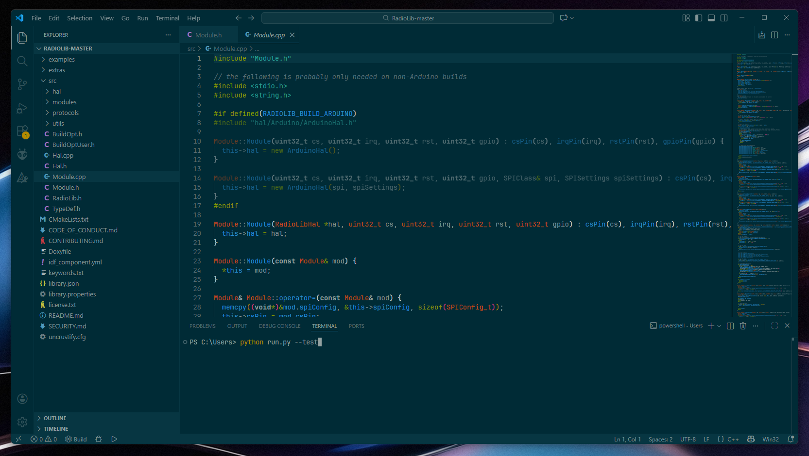

# Solarized Complete

This theme is based on the Solarized theme included with Visual Studio Code.
It extends the original workbench, terminal, and semantic coloring to provide a complete and UI-accurate [Solarized](https://ethanschoonover.com/solarized/) experience.

